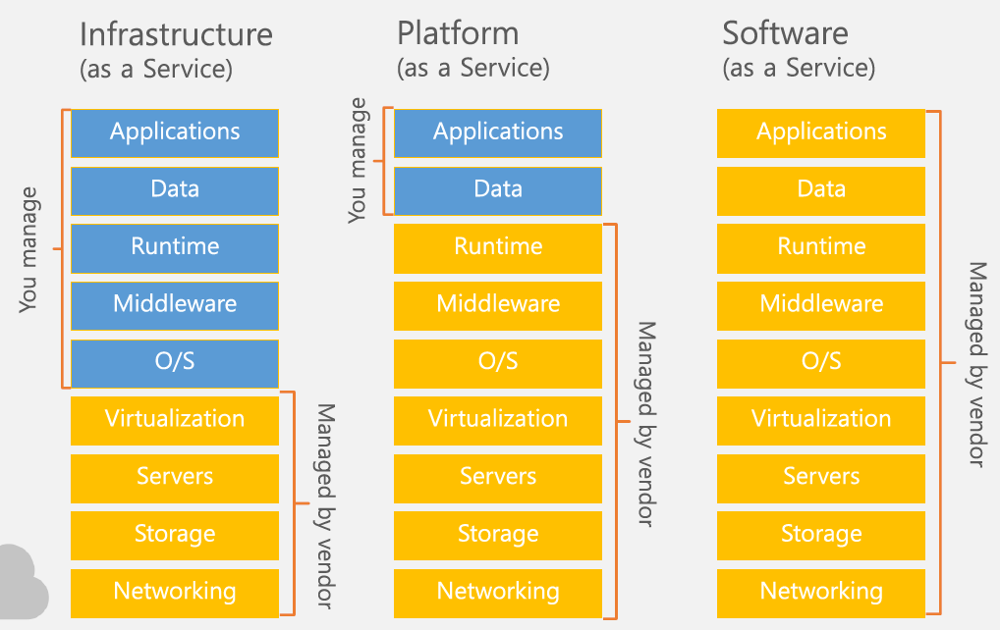

# Azure Storage, DNS, ActiveDiretory

## 1교시

### MS Cloud Services :hibiscus:

> Offics 365    - SaaS
>
> Azure
>
> ​	     VM	    - IaaS
>
> ​	Wep App  - PaaS




### 가상화 Tool

VMWare의 가상화 툴  - ESXi

MS의 가상화 툴           - Hiper-V


### Azure Storage

> **ARM (Azure Resource Manager)** 
>
> 마이크로 서비스
>
> 템플릿환경으로 배포 가능
>
> 모든 알백 지원
>
> 리소스(각각의 서비스를 그룹핑) 베이스관리

Storage 에 접근하기 위해서는 Storage Account가 필요 


### Replication 설정

>  **LRS (Locally-Redundant Storage)** 
>
> : 데이터를 업로드하면 그 데이터센터 내의 3곳에 데이터를 복제한다.
>
> **GRS (Geo-Redundant Storage)** 
>
> : 데이터 센터단위로 복제
>
> **RA-GRS (Read-Access Geo-Redundant Storage)** 
>
> : 복제된 데이터 센터에서는 Read만 가능한 것


### Networking 설정

Public : 회사에서도 접근 가능

Private : Azure 내에서만 접근 가능


## 2교시

### Storage Explorer

: Azure에 있는 Storage를 탐색기처럼 관리


## 3교시

### 객체를 관리하기 위한 단위

windows - 폴더

SQL - DB

DNS - Zone

Azure - Container


### Azure Storage의 종류

> **Blob Storage (Containers)** = 폴더
>
> > **Blob file** : ASCII file(txt) 이외의 파일 (exe, jpg, avi ..)
>
> : Blob file을 저장하는 저장소

* Page Blobs = HOT

  ​	빈번한 랜덤 엑세스에 최적화 (OS의 Disk)

* Block Blobs = COOL

  ​	가끔있는 엑세스에 최적화 (동영상, iso, 백업용) 

* Append Blob 

  ​	로그를 관리하는 것 (현재 X)

> **Table Storage** = No SQL
>
> : `key`에 `value`로 접근 (IoT) / 대량의 데이터 발생시 적합

> **Queue Storage**
>
> : 메일이나 알림셋팅을 위한 스토리지

> **File Storage**
>
> : 공유폴더에서 사용하는 `SMB 3.x`를 사용하는 스토리지
>
> > **Quota** : 용량 제한


> (2진법)  100  GB  =  98기가바이트
>
> (10진법) 100 GiB = 100기가바이트

## 4교시

> **Anonymous**
>
> : 익명 사용자 (ID와 PW가 없는)

## 5교시

**SAS (Shared Access Signature)**

: 접근에 대한 Key (언제부터 언제까지 접근가능, 특정 IP만 접근 가능 .. )


## 6교시

### 공유포트 (SMB3.0) 

wf.msc (고급 방화벽), NSG(Network Security Group)

**TCP	 445**	(3.0에서는 이 포트만 열어주면 됨)

TCP	 139

UDP	138

RDP	 137

접속방법 : net use y: \\\IP\공유명 /u:admin


### SQL

> **Azure SQL**	(PaaS)


> **SQL in an Azure VM**	(IaaS)
>
> : SQL이 설치되어있는 VM


## 7교시-8교시

### MS SQL

```mssql
/* 주석 */
-- DB만들기
create Database MyTestDB;
go

-- DB로 이동해라
use MyTestDB;
go

-- Table 만들기
create table MyTestTBL
	( idx int not null identity primary key,
	name char not null ,
	mail varchar null )

-- Table에 값 입력
insert into MyTestTBL
values('왕감자','aaa@gmail.com');
insert into MyTestTBL
values('왕고구마','bbb@gmail.com');
insert into MyTestTBL
values('왕옥수수','aaa@gmail.com');

/* DB에서 한글을 보기 위해선 옵션 'Collation'을 korean_wansung으로 */
```

### SQL Database (PaaS)

`Azure Portal`에서 만든 뒤 `방화벽` 설정해주고 SSMS에서 `Server name`과 `Authentination`을 `SQL Server`로해서 ID PW 적고 접속한다. 


### SSMS (SQL Server Management Studio)

Local, Remote SQL Server 관리 툴


> SSMS에서 원격에 있는 SQL Server을 관리하기 위해서는 **TCP 1433**포트를 열어야 함 