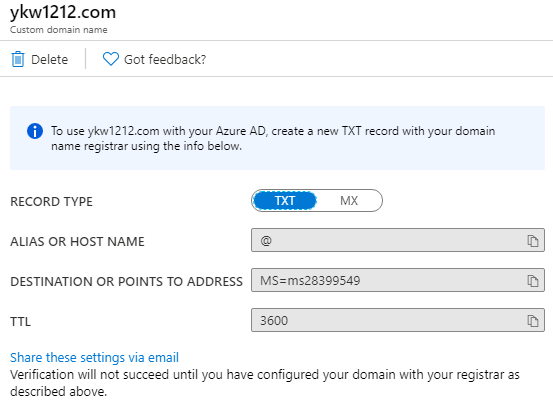

# Azure Active Directory, DNS

## 1교시

### Active Directory

> **Directory Service**
>
> : 인증을 중앙 한 곳에서 처리하는 방식
>
> - MS Directory Service - LDAP
>
> - x.500 - DAP

> **X.500** (Directory Service의 표준)
>
> : 중앙의 한 컴퓨터에 계정이나 보안 정보를 저장하고 다른 컴퓨터에서는 Directory로 셋팅하는 것 

### 도메인

> **도메인** 
>
> : 물리적으론 떨어져있으나 논리적으로 네트워크상 하나의 보안단위로 그룹핑
>
> > **SSO (Single Sign On)**
> >
> > : 한 번 로그인해서 네트워크 상의 다른 서버 이용 가능
>
> 중, 대규모 네트워트 환경
>
> `DC(Domain Controller)`에서 인증, 허가(Authorization)
>
> > **인증 (Authentication)**
> >
> > : Credential(ID + P/W)을 확인하는 것
>
> 중앙화된 관리 (GPO)
>
> 세모 모양으로 표현
>
> `Server OS`에서 `AD DS`를 다운받아야  `DC`설정 가능

> **WorkGroup**
>
> : 각각의 시스템이 보안단위
>
> 소규모 네트워크 환경에서 사용 (20대 미만)
>
> 각자의 시스템(SAM)에서 인증처리

## 2교시

### AD 종류

> **Active Directory Domain Service (AD DS)**
>
> : 인증과 허가를 하는 서버

> **Active Directory Lightweight Domain Service (AD LDS)**
>
> : 계정에 대한 간략한 정보를 가지고있는 서비스 (주로 DMZ에서)

> **Active Directory Certification Service (AD CS)**
>
> : 인증서를 배포하고 관리하는 서버

> **Active Directory Rights Management Service (AD RMS)**

> **Active Directory Federation Service (AD FS)**
>
> : Federation을 맺은 도메인과 도메인 사이에서 바로 접속이 가능하게하는 서비스 (Domain간의 SSO)

### 파일 보안

> **SACL**
>
> : 파일이나 폴더에 대한 감사기록 (누가 언제 접근했는가)

> **DACL = ACL**(Access Control List)
>
> : 파일이나 폴더에 접근 권한을 할당하는 것

> **SID**
>
> : 식별을 위해 계정이나 그룹에 할당 된 고유번호

## 3교시

> **tenant**
>
> : 하나의 보안 단위

> 

> **ARM (Azure Resource Management)**
>
> 마이크로 서비스 - 확장성
>
> Tag기능 지원 - 대량의 리소스들을 tag로 쉽게 관리
>
> RBAC 지원
>
> > **RBAC (Role Based Access Control)**

Azure Role

> Global administrator : 모든 것이 가능한 룰

## 4교시

UserA@Multicampus134.onmicrosoft.com

### Subscription 사용 허가

`Subscriptions`에서 `Access control(IAM)`은 이 이용권을 다른 사용자에게 이용이 가능하도록하는 Role을 지정할 수 있다.

## 5교시

### **MFA** 다**단**계인증

: 로그인 시 추가 인증 수단

디렉토리에서 `Users`로 해당 유저를 선택한 뒤 `Authentication methods`로 들어가 `MFA`를 설정한다.

Gumu6164

## 6교시

### Directory와 Subscription

> Subscription은 하나의 디렉토리만 적용가능하다. 
>
> 디렉토리는 여러개의 Subscription이 적용될 수 있다

### DNS Zone = DNS DB

> **DNS (Domain Name System)**
>
> : FQDN(전체 컴퓨터 이름)을 IP Address로 변환, 서비스의 위치 검색
>
> > **FQDN (Fully qualified domain name)**
> >
> > : www.naver.com 

> Forward lookup zone : Host ==> IP
>
> Reverse lookup zone  : IP      ==> Host

​	www.naver.com         ====>  125.209.222.141

​     ===  ==========    < DNS>

Host   +  Domain Name

> **Host** : 해당 네트워크에 있는 각각의 컴퓨터                                			(www, ftp, smtp, pop .. )
>
> **Domain** : Network의 이름

## 7교시

### DNS 연동

1. `DNS Zone`을 만든 뒤 실제 도메인과 연동하기 위해선 `Name-Server`을 등록해준다.

2. `디렉토리`로 들어가서 `Custom domain names`에서 도메인을 연동해준다.

3. `TXT Record`MS=ms28399549 / 3600와 `MX Record`ms28399549.msv1.invalid / 3600 / 32767를 잘 복사해둔다.
4. DNS Zone에 들어가서 연동할 domain에 들어간 뒤 Record set

​	

​	5. 디렉토리로 돌아가 확정

`Record set`

> **Record**
>
> ​	SOA	  : 권한의 시작
>
> ​	NS		 : Name Server를 지정
>
> ​	CNAME : HostName을 다른 Host Name으로 매핑
>
> ​	SRV		: Service의 위치 정보를 알려줌
>
> ​	PTR		: IP Address ==> Host Name으로 매핑
>
> ​	A			: Host Name ==> IPv4 Address로 매핑
>
> ​	AAAA	 : Host Name ==> IPv6 Address로 매핑
>
> ---
>
> ​	MX		 : 메일 서버를 지정 
>
> ​	TXT		: 특정 서버를 지정

## 8교시

### DNS의 역할

114 역할 : Host 이름을 넣으면 IP를 알려줌

네이게이션 역할 : 서비스의 위치정보를 알려줌 (SRV)

### 이름풀이(Name Resolution)

: Host 이름을 IP Address로 변환하는 과정

1.  DNS Cache ( Hosts )
2.  Local DNS
3.  LIMNR
4. NetBIOS Name Cache
5. WINS Server
6. Broadcast
7. LMHosts File

> **ipconfig /displaydns** :hibiscus:
>
> : DNS Cache를 보는 cmd 명령어
>
> > **DNS Cache** 
> >
> > : RAM에 올라가있는 DNS정보 (TTL만큼 보관)

> **ipconfig /flushdns**
>
> : DNS Cache를 제거하는 cmd 명령어

### Cache 사용 목적

1. 서버의 부하 감소

2. #### 단점

   클라이언트가 부정확한 값을 받아갈 수 있다.

   (Server에서 수정된 값 미적용)

> `windows/system32/drivers/etc/Hosts`파일에 등록된 IP는 cache에서 접근
>
> XXX.XXX.XXX.XXX	aaa	aaa.aaa.com

### DNS 쿼리

**recursive query** 

: Client가 DNS Server에 정확한 답변을 요구하기 위해 보내는 쿼리

**Iterative query**

 : 아는 부분까지만 답변을 요구하기 위해 보내는 쿼리

