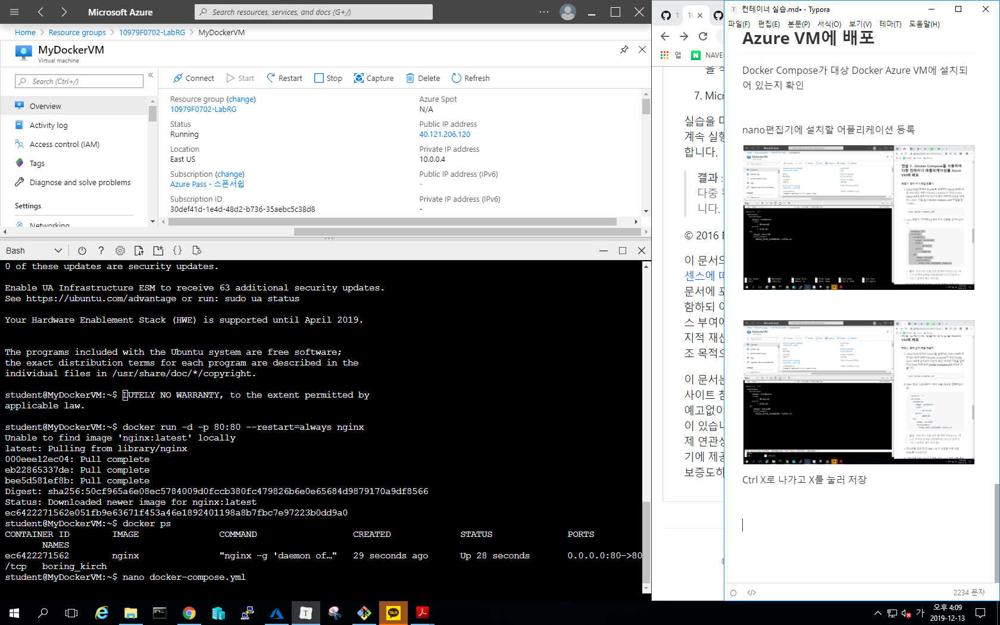
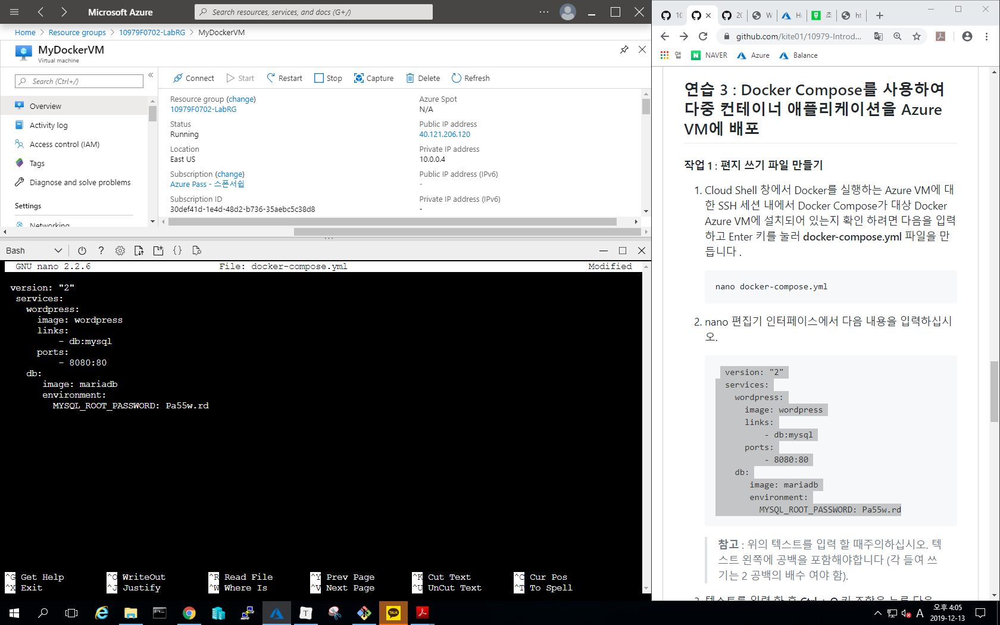
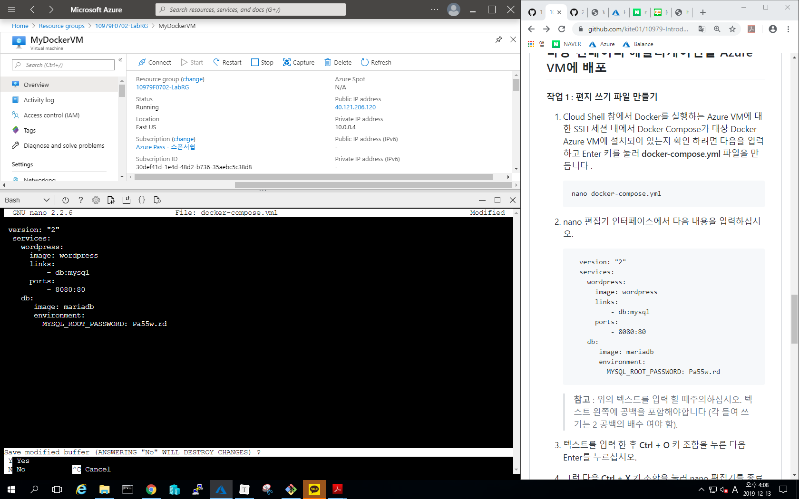
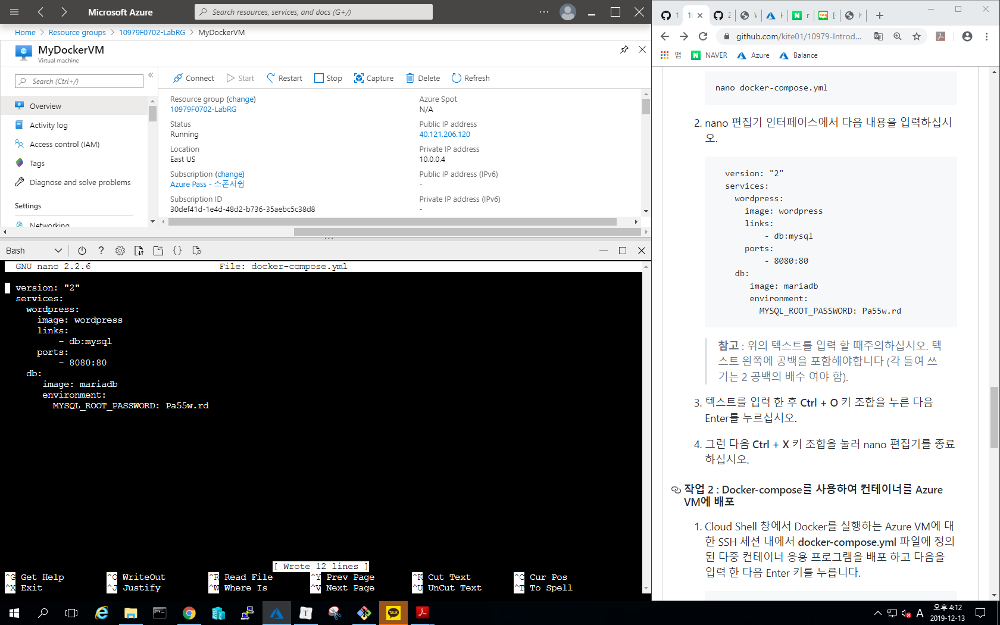
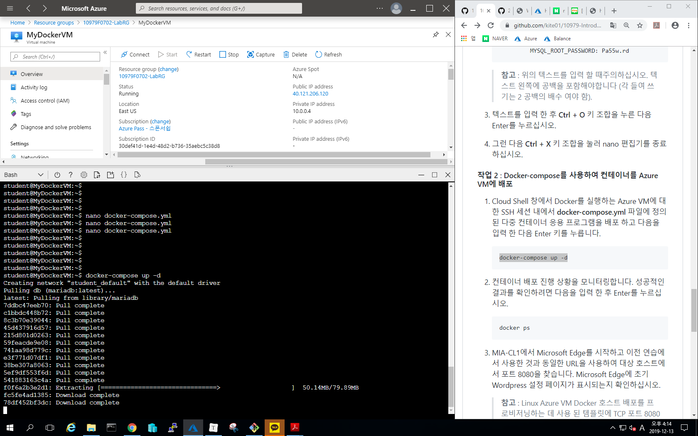
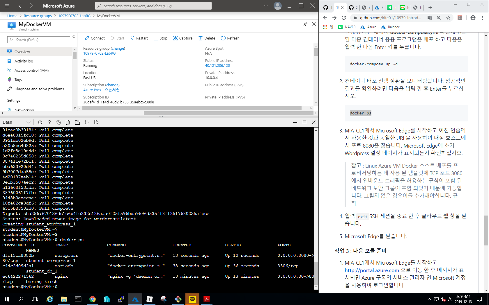
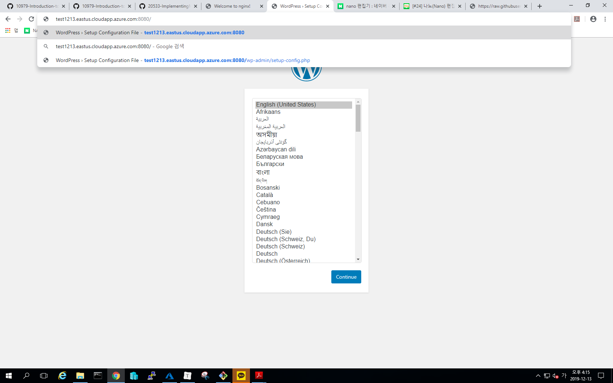
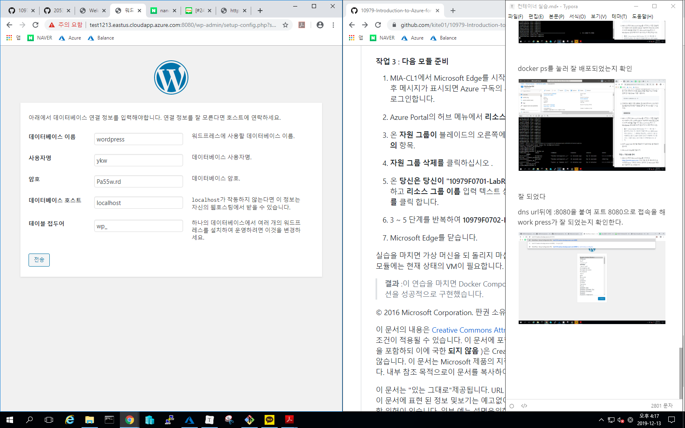

https://github.com/kite01/10979-Introduction-to-Azure-for-IT-Professionals/blob/7ea6433ebc916311257e75e778252953c84948b5/Instructions/10979F_LAB_AK_07.md#task-1-connect-to-an-azure-vm-running-docker


cloud shell 실행


cloud shell 을 bash로 바꾼다


east us에 RG를 하나 만든다


생성완료


Docker가 올라간 ubuntu를 탬플릿형식으로 설치


Azure VM에 컨테이너 배포

1. ```
   FQDN=$(az vm show --resource-group 10979F0702-LabRG --name myDockerVM --show-details --query [fqdns] --output tsv)
   ```


Azure VM에 액세스 할 수있는 정규화 된 이름을 식별


Azure VM에 대한 SSH 세션을 설정


id 비번 입력

**student @ MyDockerVM** 프롬프트 가 표시


#### Azure VM에서 실행되는 Docker 호스트에 컨테이너 배포


컨테이너 배포 진행 상황을 모니터링


정상적으로 완료되었다면 DNS url로 접속하여 잘 되었는지 확인


저게 뜨면 잘 된거


## Docker Compose를 사용하여 다중 컨테이너 애플리케이션을 Azure VM에 배포

Docker Compose가 대상 Docker Azure VM에 설치되어 있는지 확인




nano편집기에 설치할 어플리케이션 등록






Ctrl O를 누르고 엔터를 친 다음 Ctrl X를 눌러 저장 후 나온다




#### Docker-compose를 사용하여 컨테이너를 Azure VM에 배포

**docker-compose.yml** 파일에 정의 된 다중 컨테이너 응용 프로그램을 배포




docker ps를 눌러 잘 배포되었는지 확인




잘 되었다

dns url뒤에 :8080을 붙여 포트 8080으로 접속을 해 work press가 잘 되었는지 확인한다.




